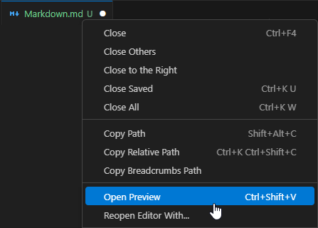

# Markdown Basics

## Was ist Markdown
Markdown ist eine einfache _Markup Language_. Das heisst Markdown definiert die 
Strukturierung und den Inhalt des Dokumentes. Markdown Dokumente verwenden die 
Dateiendung `.md`. Markdown wird in HTML verwandelt 
um es anzuzeigen. Genau das macht auch Visual Studio Code im Hintergrund, 
wenn Sie _Open Preview_ verwenden.  


---

## Headings
Headings (Überschriften) haben in Markdown ein `#`-Zeichen davor. Die Anzahl 
`#` legt die Stufe des Überschrift fest.  
Markdown:
```md
# Heading 1
## Heading 2
### Heading 3
#### Heading 4
##### Heading 5
###### Heading 6

```
HTML:
```html
<h1>Heading 1</h1>
<h2>Heading 2</h2>
<h3>Heading 3</h3>
<h4>Heading 4</h4>
<h5>Heading 5</h5>
<h6>Heading 6</h6>
```
Dargestellt:  
# Heading 1
## Heading 2
### Heading 3
#### Heading 4
##### Heading 5
###### Heading 6

---

## Paragraph
Normaler Text wird in Markdown zu einem Paragraph (Absatz).  
Beispiel, Leerschläge als `·` dargestellt:
```md 
Normaler·Text·wird·zu·einem·HTML·Paragraph.
Paragraphs·werden·mit·einer·Leerzeile·getrennt.

Damit·ein·Zeilenumbruch··
erscheint,·müssen·zwei·
Leerzeichen·am·Zeilenende·stehen
```
HTML:
```html
<p>Normaler Text wird zu einem HTML Paragraph.
Paragraphs werden mit einer Leerzeile getrennt.</p>
<p>Damit ein Zeilenumbruch<br>erscheint, müssen zwei 
Leerzeichen am Zeilenende stehen</p>
```
Dargestellt:  
Normaler Text wird zu einem HTML Paragraph.
Paragraphs werden mit einer Leerzeile getrennt.

Damit ein Zeilenumbruch  
erscheint, müssen zwei 
Leerzeichen am Zeilenende stehen

---

## Links
Die Syntax der Links besteht aus zwei Teilen:
```md
[Anzeige Text](./ziel)
```
Ziel kann eine Website, eine Datei oder auch eine Überschrift in diesem 
Dokument sein.

---

## Images
Die Syntax für Bilder ist ähnlich zur Link Syntax:
```

```
Der Alt Text wird angezeigt, wenn das Bild nicht geladen werden kann.
```html

```

---

## Code

### Inline Code
Um einen Teil einer Zeile in einer Monospace Schriftart darzustellen verwenden 
Sie <code>`</code>  
Markdown:
```md
Code `formatierung` im Text.
```
Dargestellt:  
Code `formatierung` im Text.

### Code Blocks
Wenn Code zeilenweise in einer Monospace Schriftart dargestellt werden soll 
verwenden Sie Code Blöcke. Die beginnen und enden mit <code>```</code>. Beim 
Start kann optional noch die Sprache des Codes angegeben werden. Die meissten 
Programme, die Markdown rendern, unterstützen dann auch Syntax highlighting.  
Markdown:  
````
```rust
fn main() {
	// Print text to the console.
	println!("Hello World!");
}
```
````
Dargestellt:  
```rust
fn main() {
	// Print text to the console.
	println!("Hello World!");
}
```

## Weiter Resourcen

- https://www.markdownguide.org/basic-syntax/
- https://docs.github.com/de/get-started/writing-on-github/getting-started-with-writing-and-formatting-on-github/basic-writing-and-formatting-syntax
